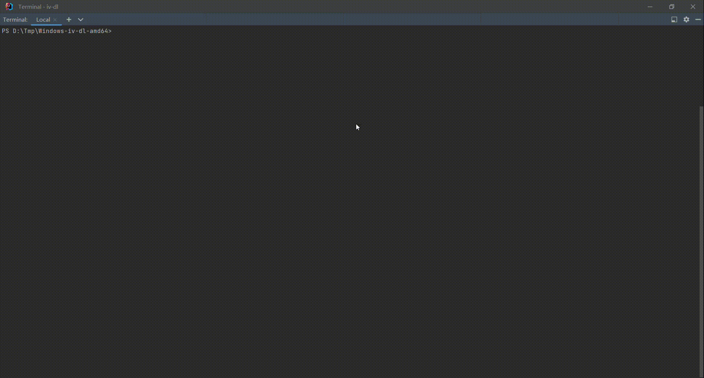

<div align=center></div>

> 关于
> 
> iv-dl是将[invidious api](https://docs.invidious.io/api/)数据进行封装后交给[yt-dlp](https://github.com/yt-dlp/yt-dlp)进行下载的工具

> 支持链接
> 
> 可直接复制实例链接或者youtube官方链接，例如https://www.youtube.com/watch?v=I8yBbwRurAE 或 https://yt.artemislena.eu/watch?v=I8yBbwRurAE

> 选项
> 
> 支持`yt-dlp`的选项

> 准备工作
>
> 安装 [yt-dlp](https://github.com/yt-dlp/yt-dlp) <br>
> 下载 [iv-dl](https://github.com/yajuhua/iv-dl/releases/latest)
> 

>示例
>
>```bash
>iv-dl.exe --proxy http://127.0.0.1:10809 -f bestvideo+bestaudio https://www.youtube.com/watch?v=I8yBbwRurAE
>```
>
>
